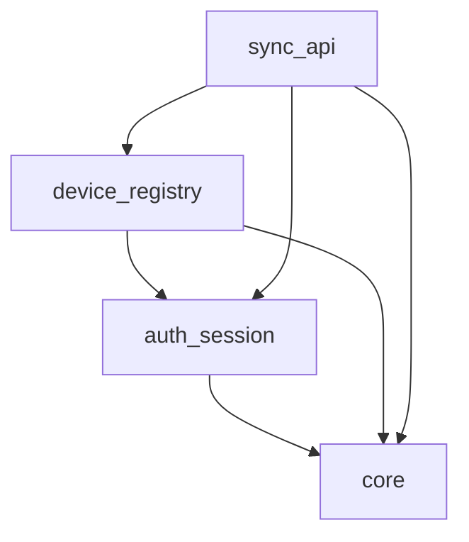

# Scribble Backend API

> Scribble의 멀티디바이스 동기화와 인증을 담당하는 백엔드 서버.
> v1의 백엔드는 일반적인 도메인 CRUD 서버가 아니라, offline-first 클라이언트를 위한 인증/디바이스/동기화 인프라로 설계한다.

---

## 1) 제품 내 역할

Scribble의 데이터 SoT는 기본적으로 클라이언트 로컬 DB(SQLite)다. 네이티브 클라이언트는 로컬 우선으로 동작하고, 백엔드는 다음 책임에 집중한다.

- 계정 인증과 세션 관리
- 디바이스 등록 및 검증
- 멀티디바이스 간 변경분 동기화
- 동기화 프로토콜과 에러 계약의 안정적 제공

즉, v1 백엔드는 도메인별 서버 비즈니스 로직보다 **동기화 허브** 역할이 우선이다.

---

## 2) v1 목표

- **인증 허브:** 계정 생성, 로그인, 세션 복구, 토큰 갱신, 로그아웃
- **디바이스 식별:** 사용자별 디바이스 등록/조회/해제, 동기화 시 device 검증
- **동기화 허브:** push/pull, cursor 기반 증분 동기화, LWW, tombstone
- **명확한 모듈 경계:** auth, device, sync를 독립 이해 가능한 문맥으로 유지
- **문서 우선 개발:** 모든 모듈에 `module.md`, `contracts.md`, `test.md`를 두고 설계를 먼저 고정

---

## 3) 비목표

다음 항목은 v1의 백엔드 직접 범위가 아니다.

- Daily Plan / Calendar / Memo / Note / Archive / Settings의 서버사이드 CRUD
- 서버 중심 데이터 모델링을 전제로 한 웹 우선 아키텍처
- WebSocket 실시간 전송
- CRDT 기반 고급 병합
- 관리자 콘솔
- Rate limiting / API key 관리
- S3 기반 바이너리 저장

도메인별 서버 API와 바이너리 저장은 웹 플랫폼 요구가 커지는 시점에 별도 모듈로 추가한다.

---

## 4) 기술 선택

### 4.1 패키지 / 실행 환경

- Python 패키지 관리는 `uv`를 사용한다.
- 의존성 정의는 `pyproject.toml`에 둔다.
- lockfile은 `uv.lock` 기준으로 관리한다.

### 4.2 백엔드 런타임

- Framework: `FastAPI`
- ASGI server: `uvicorn`
- ORM: `SQLAlchemy 2.x` async ORM
- DB driver: `asyncpg`
- Migration: `Alembic`
- Validation / settings: `Pydantic v2` + `pydantic-settings`
- JWT: `PyJWT`
- Password hashing: `pwdlib`

### 4.3 DB 운영 가정

- DBMS는 `PostgreSQL 16+`를 기준으로 한다.
- case-insensitive email을 위해 `citext` extension을 사용한다.
- 모든 시각 필드는 UTC 기준 `timestamptz`로 저장한다.
- migration은 Alembic으로만 관리하고 수동 SQL drift를 허용하지 않는다.

---

## 5) 아키텍처 원칙

### 5.1 Offline-First 보조 서버

- 네이티브 클라이언트의 데이터 SoT는 로컬 DB다.
- 백엔드는 클라이언트 변경 이벤트를 중계하고 증분 동기화를 제공한다.
- 클라이언트는 로컬 쓰기를 먼저 완료한 뒤 비동기로 sync를 수행한다.

### 5.2 Layered + Modular

백엔드 내부 구조는 다음 계층으로 고정한다.

1. **Models/Schemas**: DB 모델(SQLAlchemy) + API DTO(Pydantic)
2. **Repository**: DB 접근과 영속화
3. **Service**: 비즈니스 규칙과 트랜잭션 경계
4. **Router**: FastAPI 엔드포인트, 요청 검증, 응답 직렬화

의존 방향은 다음과 같다.

```text
router -> service -> repository -> models
                             -> schemas
```

### 5.3 Core 우선

모든 모듈은 공통 인프라를 `core`에서 공유한다.

- DB 엔진/세션
- Config
- AppError / error handler
- auth dependency
- request-id / CORS middleware
- pagination / cursor 유틸

### 5.4 모듈 간 통신 규칙

- 동일 계층 모듈 간 직접 import 금지
- 교차 모듈 호출은 service 계층 인터페이스를 통해 수행
- sync는 도메인 모듈에 의존하지 않고 event envelope 계약만 안다
- 공유 계약은 모듈 문서 또는 상위 계약 문서에서 먼저 정의한다

### 5.5 문서 우선 원칙

모든 모듈은 코드 디렉토리 안에 아래 3문서를 포함한다.

- `module.md`: 목표, 책임, 비책임, 의존 방향
- `contracts.md`: API DTO, 에러, 저장 계약
- `test.md`: 회귀/경계/실패 케이스

---

## 6) v1 모듈 분해

### 6.1 core

공유 인프라 계층.

- settings
- database session / base model
- error model / exception handler
- auth dependency helpers
- middleware
- pagination / cursor helpers

### 6.2 auth_session

인증과 세션 수명주기.

- 계정 생성
- 로그인
- access / refresh token 발급
- 세션 검증
- 토큰 갱신
- 로그아웃
- 현재 사용자 조회

### 6.3 device_registry

사용자별 디바이스 등록/관리.

- 디바이스 등록
- 디바이스 목록 조회
- 디바이스 해제
- 디바이스 수 제한 정책
- sync 요청의 device 검증
- last_sync_at 갱신

### 6.4 sync_api

멀티디바이스 동기화 엔드포인트.

- push: 변경 이벤트 업로드
- pull: cursor 이후 변경분 다운로드
- cursor 만료 판정
- LWW 충돌 해결
- tombstone 동기화
- sync event 저장과 재생성

---

## 7) 모듈 의존 관계



의존 규칙은 다음과 같다.

| 출발 | 허용 대상 | 금지 |
|---|---|---|
| core | 없음 | 모든 상위 모듈 |
| auth_session | core | device_registry, sync_api |
| device_registry | core, auth_session | sync_api의 내부 구현 |
| sync_api | core, auth_session, device_registry | 도메인 서버 모듈 직접 의존 |

---

## 8) v1 데이터 전략

### 8.1 Auth / Session

- 사용자 계정은 서버 DB에 저장
- refresh session은 서버에서 관리하고 무효화 가능해야 한다
- access token은 짧게, refresh token은 회전 가능하게 설계한다

### 8.2 Device Registry

- 디바이스는 사용자 계정에 종속된다
- 모든 sync 요청은 인증된 사용자 + 유효한 device 조합이어야 한다
- 디바이스 해제 시 이후 sync는 거부한다

### 8.3 Sync

- sync 이벤트는 도메인 비의존 envelope로 저장한다
- 최소 필드:
  - event_id
  - user_id
  - device_id
  - entity_type
  - entity_id
  - operation
  - payload
  - logical_timestamp 또는 updated_at
  - deleted_at
- pull은 cursor 이후 이벤트를 반환한다
- 충돌은 기본적으로 `updated_at` 기준 LWW로 해결한다

---

## 9) 디렉토리 구조

```text
apps/backend_api/
├── PROJECT.md
├── pyproject.toml
├── uv.lock
├── alembic.ini
└── src/
    ├── core/
    │   ├── module.md
    │   ├── contracts.md
    │   ├── test.md
    │   ├── __init__.py
    │   ├── config.py
    │   ├── database.py
    │   ├── errors.py
    │   ├── auth_deps.py
    │   └── middleware.py
    ├── auth_session/
    │   ├── module.md
    │   ├── contracts.md
    │   ├── test.md
    │   ├── __init__.py
    │   ├── models.py
    │   ├── schemas.py
    │   ├── repository.py
    │   ├── service.py
    │   ├── router.py
    │   └── errors.py
    ├── device_registry/
    │   ├── module.md
    │   ├── contracts.md
    │   ├── test.md
    │   ├── __init__.py
    │   ├── models.py
    │   ├── schemas.py
    │   ├── repository.py
    │   ├── service.py
    │   ├── router.py
    │   └── errors.py
    └── sync_api/
        ├── module.md
        ├── contracts.md
        ├── test.md
        ├── __init__.py
        ├── models.py
        ├── schemas.py
        ├── repository.py
        ├── service.py
        ├── router.py
        └── errors.py
```

---

## 10) 모듈 크기 관리 규칙

다음 조건 중 하나를 넘기면 모듈 분리를 검토한다.

- 엔드포인트 8개 초과
- DTO/에러 타입 25개 초과
- 서비스 메서드 12개 초과
- 외부 모듈 의존 3개 초과

목표는 "모듈 하나 = 한 번에 이해 가능한 문맥"을 유지하는 것이다.

---

## 11) 확장 계획

다음 요구가 현실화되면 별도 모듈을 추가한다.

- 웹 플랫폼에서 서버 직접 CRUD가 본격 필요해질 때
- Archive 이미지나 첨부파일의 서버 저장이 필요해질 때
- 백엔드가 단순 sync 허브를 넘어 서버 비즈니스 로직을 갖게 될 때

예상 추가 모듈 예시는 다음과 같다.

- `dailyplan_api`
- `calendar_api`
- `memo_api`
- `note_api`
- `archive_api`
- `settings_api`
- `binary_storage`

이 모듈들은 v1 스캐폴드에 포함하지 않는다.
