# Module Index

## 전체 모듈 목록

### Shared (2)
| 모듈 | 위치 | 설명 |
|---|---|---|
| shared/kernel | `lib/shared/kernel/` | ID, Result, AppError, TimeUtils, EventBus |
| shared/ui | `lib/shared/ui/` | AppColors, 테마, 공통 UI |

### Domain Core (5)
| 모듈 | 위치 | 설명 |
|---|---|---|
| dailyplan-domain | `lib/domain/dailyplan_domain/` | Plan/Routine/Tag/시간 규칙 |
| calendar-domain | `lib/domain/calendar_domain/` | 캘린더 이벤트 규칙 |
| memo-domain | `lib/domain/memo_domain/` | Memo(Todo) 규칙 |
| note-domain | `lib/domain/note_domain/` | Note 규칙 |
| archive-domain | `lib/domain/archive_domain/` | Archive 수집 규칙 |

### Usecase / Orchestration (6)
| 모듈 | 위치 | 설명 |
|---|---|---|
| dailyplan-usecases | `lib/usecases/dailyplan_usecases/` | Plan CRUD, 템플릿 관리 |
| calendar-usecases | `lib/usecases/calendar_usecases/` | 캘린더 CRUD, Memo→Calendar |
| memo-usecases | `lib/usecases/memo_usecases/` | Memo CRUD, 정렬, 알람, 전환 |
| note-usecases | `lib/usecases/note_usecases/` | Note CRUD, ingest |
| archive-usecases | `lib/usecases/archive_usecases/` | Share 수신, 수집, Archive→Note |
| sync | `lib/usecases/sync/` | 동기화 (outbox/inbox/conflict/cursor) |

### Platform Adapters — Client (12)
| 모듈 | 위치 | 설명 |
|---|---|---|
| app-shell | `lib/app_shell/` | 진입점, 라우팅, **조건부 DI** (`di/`) |
| ui-dailyplan | `lib/adapters/ui_dailyplan/` | Daily Plan UI |
| ui-calendar | `lib/adapters/ui_calendar/` | Calendar UI |
| ui-memo | `lib/adapters/ui_memo/` | Memo UI |
| ui-note | `lib/adapters/ui_note/` | Note UI |
| ui-archive | `lib/adapters/ui_archive/` | Archive UI |
| share-intent | `lib/adapters/share_intent/` | OS 공유(Share Intent) payload 수신 후 archive-usecases로 전달 |
| widget-todo | `lib/adapters/widget_todo/` | Memo 위젯 (네이티브 전용) |
| widget-calendar | `lib/adapters/widget_calendar/` | Calendar 위젯 (네이티브 전용) |
| widget-dailyplan | `lib/adapters/widget_dailyplan/` | DailyPlan 위젯 (네이티브 전용) |
| storage-sqlite | `lib/adapters/storage_sqlite/` | Drift DB 구현 **(네이티브 전용)** |
| api-client | `lib/adapters/api_client/` | 백엔드 HTTP + **웹 CRUD (ApiMemoService)** |

### Platform Adapters — Backend (3)
| 모듈 | 위치 | 설명 |
|---|---|---|
| auth-session | `backend_api/src/auth_session/` | 인증/세션 |
| device-registry | `backend_api/src/device_registry/` | 디바이스 등록 |
| sync-api | `backend_api/src/sync_api/` | 동기화 엔드포인트 |

---

## 플랫폼별 데이터 흐름

```
네이티브 (모바일/데스크톱):
  UI → memoServiceProvider → DriftMemoService → SQLite
                                                  ↕ (sync)
                                              서버 API

웹:
  UI → memoServiceProvider → ApiMemoService → 서버 API (직접)
```

조건부 DI (`app_shell/di/`):
- `dart.library.io` → `di_native.dart` (DriftMemoService)
- `dart.library.js_interop` → `di_web.dart` (ApiMemoService)
- 컴파일 타임에 결정되어 웹 빌드에 dart:ffi 코드가 포함되지 않음

공유 브릿지 흐름:
- OS Share Intent → `adapters/share_intent` → `archive-usecases(HandleShare)`

---

## 의존 관계 다이어그램

```mermaid
graph TD
    subgraph "Shared"
        K[shared/kernel]
        UI_S[shared/ui]
    end

    subgraph "Domain Core"
        DP_D[dailyplan-domain]
        CAL_D[calendar-domain]
        MEMO_D[memo-domain]
        NOTE_D[note-domain]
        ARC_D[archive-domain]
    end

    subgraph "Usecase / Orchestration"
        DP_U[dailyplan-usecases]
        CAL_U[calendar-usecases]
        MEMO_U[memo-usecases]
        NOTE_U[note-usecases]
        ARC_U[archive-usecases]
        SYNC[sync]
    end

    subgraph "Adapters — UI"
        UI_DP[ui-dailyplan]
        UI_CAL[ui-calendar]
        UI_MEMO[ui-memo]
        UI_NOTE[ui-note]
        UI_ARC[ui-archive]
        SHARE[share-intent]
    end

    subgraph "Adapters — Widget"
        W_TODO[widget-todo]
        W_CAL[widget-calendar]
        W_DP[widget-dailyplan]
    end

    subgraph "Adapters — Infra"
        SHELL[app-shell + di/]
        SQLITE[storage-sqlite<br>네이티브 전용]
        API[api-client<br>sync + 웹 CRUD]
    end

    subgraph "Backend"
        B_AUTH[auth-session]
        B_DEV[device-registry]
        B_SYNC[sync-api]
    end

    %% Domain → Kernel
    DP_D --> K
    CAL_D --> K
    MEMO_D --> K
    NOTE_D --> K
    ARC_D --> K

    %% Usecases → Domain
    DP_U --> DP_D
    CAL_U --> CAL_D
    CAL_U -.-> MEMO_D
    MEMO_U --> MEMO_D
    MEMO_U -.-> NOTE_D
    MEMO_U -.-> CAL_D
    NOTE_U --> NOTE_D
    NOTE_U -.-> MEMO_D
    NOTE_U -.-> ARC_D
    ARC_U --> ARC_D
    SYNC --> K

    %% Usecases → Kernel
    DP_U --> K
    CAL_U --> K
    MEMO_U --> K
    NOTE_U --> K
    ARC_U --> K

    %% Cross-usecase (인터페이스 주입)
    ARC_U -.->|Archive→Note| NOTE_U
    MEMO_U -.->|Memo→Note| NOTE_U
    MEMO_U -.->|Memo→Calendar| CAL_U

    %% UI → Usecases + shared/ui
    UI_DP --> DP_U
    UI_DP --> UI_S
    UI_CAL --> CAL_U
    UI_CAL --> UI_S
    UI_MEMO --> MEMO_U
    UI_MEMO --> UI_S
    UI_NOTE --> NOTE_U
    UI_NOTE --> UI_S
    UI_ARC --> ARC_U
    UI_ARC --> UI_S
    SHARE --> ARC_U

    %% Widget → Domain (타입 참조)
    W_TODO --> MEMO_D
    W_CAL --> CAL_D
    W_DP --> DP_D

    %% Infra implements
    SQLITE -.->|implements| MEMO_U
    SQLITE -.->|implements| DP_U
    SQLITE -.->|implements| CAL_U
    SQLITE -.->|implements| NOTE_U
    SQLITE -.->|implements| ARC_U
    SQLITE -.->|implements SyncStorage| SYNC
    API -.->|implements SyncRemote| SYNC
    API -.->|implements MemoService<br>웹 전용| MEMO_U

    %% App Shell — 조건부 DI
    SHELL --> UI_DP
    SHELL --> UI_CAL
    SHELL --> UI_MEMO
    SHELL --> UI_NOTE
    SHELL --> UI_ARC
    SHELL --> SYNC
    SHELL --> UI_S
    SHELL -.->|네이티브| SQLITE
    SHELL -.->|웹| API

    %% Backend
    API -->|HTTP| B_SYNC
    B_SYNC --> B_AUTH
    B_SYNC --> B_DEV

    %% Legend
    classDef domain fill:#4a9eff,color:#fff
    classDef usecase fill:#ff9f43,color:#fff
    classDef adapter fill:#2ed573,color:#fff
    classDef backend fill:#a55eea,color:#fff
    classDef shared fill:#747d8c,color:#fff

    class K,UI_S shared
    class DP_D,CAL_D,MEMO_D,NOTE_D,ARC_D domain
    class DP_U,CAL_U,MEMO_U,NOTE_U,ARC_U,SYNC usecase
    class UI_DP,UI_CAL,UI_MEMO,UI_NOTE,UI_ARC,SHARE,W_TODO,W_CAL,W_DP,SHELL,SQLITE,API adapter
    class B_AUTH,B_DEV,B_SYNC backend
```



### 범례
- **실선 화살표** → 직접 의존 (import)
- **점선 화살표** → 인터페이스 주입 또는 조건부 참조
- 의존 방향: 항상 위 → 아래 (adapter → usecase → domain → kernel)
